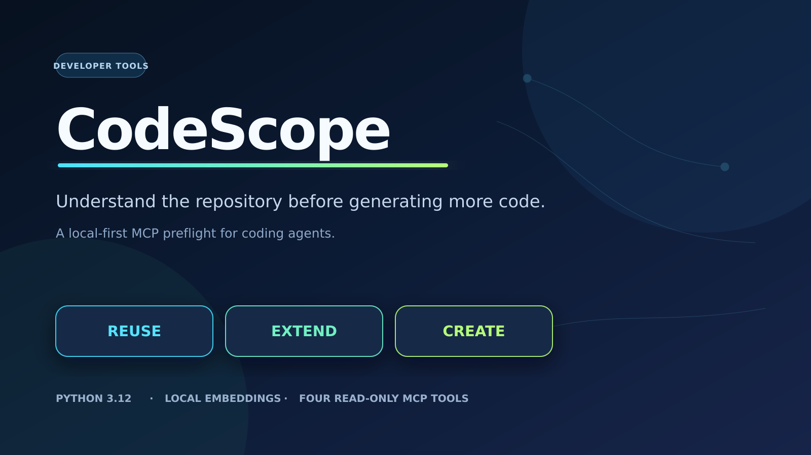
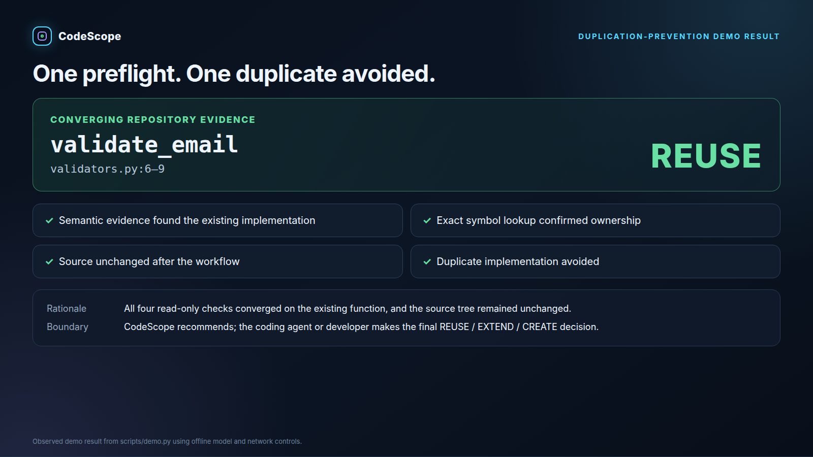
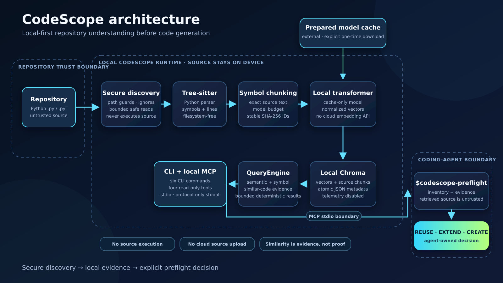

# CodeScope



**Understand the repository before generating more code.**

CodeScope is a local-first MCP preflight for Python developer tools. It helps Codex and other
coding agents inspect existing implementations before editing, then make an evidence-backed
**REUSE**, **EXTEND**, or **CREATE** decision.

## Verified duplication-prevention demo

This is a deterministic small-fixture demonstration, not a large-repository performance claim.

| Evidence | Observed result |
|---|---|
| Indexed | 4 files, 11 symbols, 16 chunks |
| Requested task | Email validation before account creation |
| Existing implementation | `validate_email` |
| Location | `validators.py:6–9` |
| Recommendation | **REUSE** |
| Source changed | No |
| Duplicate created | No |



### Demo alignment

The reproducible repository and judge route are the email-validation demonstration above. A separate
owner-supplied routing-ownership recording is 5:47 and its `RoutingPolicy` / `ResponseSla`
comparison fixture is not present in this repository. It is therefore not an eligible final
submission video and is not judge-route evidence. Before submission, the owner must either record
a sub-three-minute narrated video of the reproducible email-validation route or add and document a
reproducible routing comparison without private artifacts.

## Problem and solution

AI coding agents can produce plausible new code without first establishing what an existing
repository already owns. That can create duplicate validators, helpers, and services, inconsistent
behavior, architectural drift, and additional maintenance work.

CodeScope makes repository understanding a concrete preflight. It securely discovers local Python
source, extracts symbols, creates tokenizer-budgeted chunks, produces local embeddings, persists a
local index, and exposes semantic plus exact-symbol evidence through a CLI and four read-only MCP
tools. A repository-scoped skill compares behavior, ownership, differences, confidence, and
uncertainty before recommending REUSE, EXTEND, or CREATE.

## Why CodeScope is different

- **Evidence before generation:** inventory, behavioral search, exact symbols, and similar-code
  evidence are gathered before an edit is proposed.
- **Local-first privacy:** source and vectors stay local; no cloud embedding API is used.
- **A decision workflow, not a score:** similarity is evidence rather than proof, and the coding
  agent or developer owns the final decision.
- **Explicit trust boundaries:** retrieved repository content is untrusted evidence, never
  instructions, and CodeScope never executes indexed source.
- **A complete developer-tool path:** index → inspect → search → MCP → preflight →
  REUSE/EXTEND/CREATE.

## How it works



1. Central path guards and mandatory exclusions contain repository discovery.
2. Tree-sitter extracts Python symbols without filesystem access.
3. Symbol-aware chunking preserves source ownership and the embedding model's real token budget.
4. A prepared local sentence-transformer embeds chunks into telemetry-disabled local Chroma.
5. QueryEngine provides deterministic semantic, symbol, similar-code, and status operations.
6. The CLI and local stdio MCP server expose safe read-only evidence.
7. `$codescope-preflight` turns converging evidence into a traceable recommendation.

See [the complete architecture and trust boundaries](docs/ARCHITECTURE.md).

## Current implementation status

OpenAI Build Week Phases 0–10 are complete at commit `39f85be`. Phase 11 submission packaging is
in progress and remains uncommitted pending owner review. The repository currently provides:

- a Python 3.12 package with `version`, `index`, `status`, `search`, `serve`, and `reset` commands;
- immutable validated configuration, public models, stable domain errors, and centralized path guards;
- Tree-sitter Python symbol extraction and model-budgeted, symbol-aware source chunking;
- lazy cache-only Sentence Transformers embeddings and telemetry-disabled persistent Chroma storage;
- secure deterministic `.py` and `.pyi` discovery with configured and root `.gitignore` exclusions;
- mandatory secret, environment, cache, model, archive, image, database, build, and dependency-tree exclusions that repository negation rules cannot re-enable;
- bounded descriptor reads with size-race, regular-file, binary, and strict UTF-8 checks;
- contained symlink handling with physical-file deduplication and cycle prevention;
- bounded embedding batches, deterministic source metadata, SHA-256 hashes, and stable chunk IDs;
- failure-safe full-index rebuilds in restricted sibling directories, verified before promotion;
- rollback-capable live-index replacement with exact generated-path cleanup;
- atomic `symbols.json` and `index_meta.json` persistence plus bounded metadata reads;
- status validation that reconciles metadata, symbol, language, model, fingerprint, Chroma count, and runtime size.
- a read-only query engine for semantic search, exact and partial symbol lookup, similar-code evidence, and authoritative index status;
- bounded source-only snippets, deterministic ranking and tie-breaking, finite relevance scores, and stable typed query failures.
- a production Typer/Rich CLI for safe indexing, authoritative status, semantic search, deterministic JSON, and exact-runtime reset;
- a lazy local stdio MCP server exposing exactly four read-only tools: `search_code`, `find_symbol`, `find_similar`, and `list_indexed_files`;
- structured safe tool errors, strict nonreflective protocol validation, read-only annotations, protocol-only stdout, and explicit untrusted-source instructions;
- verified Codex MCP configuration examples under `.codex/config.toml.example` and `examples/codex_mcp_config.toml`;
- a repository-scoped `$codescope-preflight` skill that inventories first, gathers semantic,
  exact-symbol, and similar-code evidence, and reports REUSE, EXTEND, or CREATE before editing;
- a fixed cache-only duplication-prevention demo that uses the real stdio MCP server, verifies the
  canonical fixture and before/after source hashes, and leaves its isolated runtime temporary.
- a bounded offline fixture benchmark with direct query, MCP, and demo timing;
- a clean-candidate verifier that applies the working-tree patch to a real no-local clone, creates
  a fresh locked environment, runs the CLI/MCP/demo judge path, proves source immutability, and
  removes temporary state;
- release security, setup, architecture, API, benchmark, coverage, and troubleshooting evidence;
- verified sdist/wheel license metadata, artifact contents, and fresh-wheel installation.

CodeScope can build, validate, query, and reset a local index for a Python repository through its
CLI, typed Python engine API, four-tool local MCP interface, and agent preflight workflow. The
Phase 11 release, video, final `/feedback` capture, Devpost draft creation, and actual submission
remain separately owner-gated and incomplete.

## Requirements

- Python 3.12
- [uv](https://docs.astral.sh/uv/)
- A platform supported by the locked Python dependencies

Phases 1 through 10 have been validated in the current Linux development environment. Public paths
and path guards have cross-platform tests, but broader macOS/Windows execution claims remain
unverified.

## Setup

Clone the repository, then install the locked development environment:

```bash
uv sync --locked
```

The default configuration is [`codescope.toml`](codescope.toml). Configuration paths are resolved relative to that file. The indexing root must already exist; `codescope index` creates the configured runtime only for a validated rebuild.

The first preparation of the default embedding model requires explicit network permission and a local cache outside the repository. Normal indexing is cache-only and fails safely with an actionable message when the model is unavailable. Use `--allow-model-download` only for an explicitly authorized one-time preparation run.

## Current operation

Run the current acceptance path from the repository root after the default model has been prepared locally:

```bash
uv run codescope version
uv run codescope index tests/fixtures/sample_python
uv run codescope status
uv run codescope search "email validation"
uv run codescope search "email validation" --json
uv run codescope reset --yes
uv run python scripts/demo.py
uv run python scripts/demo.py --json
```

The isolated offline demonstration indexed 4 files into 11 symbols and 16 chunks. Inventory,
semantic, exact-symbol, and similar-code calls converged on `validate_email` at `validators.py`
lines 6–9, the report recommended REUSE, exact source hashes remained unchanged, and no
`is_valid_email` duplicate was created. The model still requires one explicit external-cache
preparation step.

For the no-source-build release route, locked source route, and evidence-only route, see
[`docs/JUDGE_TESTING.md`](docs/JUDGE_TESTING.md). For the complete setup and clean-candidate
prerequisites, see [`docs/SETUP.md`](docs/SETUP.md). A parser-fixed July 22 Linux candidate
reached the fixed demo in 60.855 seconds after setup timing began and completed in 63.586 seconds
total, excluding model download. This is
an environment-specific observation, not a universal guarantee.

## Measured evidence

| Gate | Observed final-candidate evidence |
|---|---:|
| Production coverage | 91% — 2,838 statements, 245 missed |
| Unit tests | 492 passed |
| Security tests | 102 passed |
| Offline real-model matrix | 37 passed |
| Clean candidate to demo | 60.855 seconds |
| Fixture semantic-search median | 54.975 ms |
| Fixture pooled MCP round-trip median | 66.611 ms |

These values were measured on the documented Linux environment and small committed fixture. They
are not universal latency, scale, or semantic-quality guarantees. See
[`docs/COVERAGE.md`](docs/COVERAGE.md), [`docs/BENCHMARKS.md`](docs/BENCHMARKS.md), and
[`docs/SECURITY.md`](docs/SECURITY.md) for methods and limitations.

## Local MCP operation

From the repository root, prepare the configured model and build an index before semantic calls, then start the protocol server with:

```bash
uv run codescope serve
```

The server writes MCP JSON-RPC traffic only to stdout and performs no repository scan, model load, Chroma open, or index creation at startup. Missing indexes become structured `INDEX_NOT_FOUND` tool results rather than startup failures.

For Codex, copy the `mcp_servers.codescope` table from [`.codex/config.toml.example`](.codex/config.toml.example) or [`examples/codex_mcp_config.toml`](examples/codex_mcp_config.toml) into a trusted Codex configuration. Launch Codex from the CodeScope repository root, verify registration with `codex mcp list`, and inspect the tools with `/mcp`. The examples use only configuration keys verified against the installed Codex CLI and current official Codex MCP documentation; they do not modify the active project configuration.

## Testing

Run the current checks with:

```bash
uv run pytest tests/unit -q
uv run pytest tests/integration -q
uv run pytest tests/security -q
uv run pytest tests/e2e -q
uv run pytest tests/release -q
uv run ruff check .
uv run ruff format --check .
uv run mypy src/codescope
uv run mypy scripts/demo.py scripts/benchmark.py scripts/verify_clean_setup.py
uv run codescope version
```

Phase-specific commands and observed results are recorded in
[`BUILD_WEEK_CHANGELOG.md`](BUILD_WEEK_CHANGELOG.md). Hackathon submission requirements are
tracked in [`docs/HACKATHON_COMPLIANCE.md`](docs/HACKATHON_COMPLIANCE.md).

## Technical documentation

- [Setup and judge path](docs/SETUP.md)
- [Judge testing: release, locked source, and evidence-only routes](docs/JUDGE_TESTING.md)
- [Architecture and trust boundaries](docs/ARCHITECTURE.md)
- [CLI and MCP API](docs/API.md)
- [Security model and dependency/license inventory](docs/SECURITY.md)
- [Fixture benchmark methodology and measured values](docs/BENCHMARKS.md)
- [Coverage methodology and per-module evidence](docs/COVERAGE.md)
- [Troubleshooting](docs/TROUBLESHOOTING.md)
- [Codex handoff](docs/CODEX_HANDOFF.md)
- [Duplication-prevention demo runbook](docs/DEMO_SCRIPT.md)
- [Build Week video script and verification](docs/VIDEO_SCRIPT.md)
- [Submission screenshot capture and privacy review](docs/SCREENSHOT_PLAN.md)
- [Final release and submission checklist](docs/FINAL_RELEASE_CHECKLIST.md)

## Sample data

The license-safe fixtures under `tests/fixtures/sample_python/` cover representative Python syntax
and serve as the deterministic indexing, query, benchmark, and clean-setup sample.
`tests/fixtures/duplication_demo/task.json` defines the fixed email-validator task. Unit tests use
injected model/tokenizer/storage seams without network access; explicit integration, e2e,
benchmark, and clean-candidate checks exercise the already cached default model offline through the
real stdio server.

## Current limitations

- Python repositories only; supported source extensions are `.py` and `.pyi`.
- Only the repository-root `.gitignore` is interpreted; nested `.gitignore` semantics are deferred.
- No symbol or similar-code CLI subcommands; those evidence paths are available through MCP and the
  preflight skill.
- The real model must be prepared explicitly before cache-only use; no model assets are stored in this repository.
- Repository setup uses `uv sync --locked` for exact locked dependency reproduction. A standalone
  wheel install resolves the package's compatible dependency ranges and is not an exact substitute
  for the repository lockfile.
- The demonstration fixture is intentionally small, and a REUSE, EXTEND, or CREATE recommendation
  still requires agent judgment; similarity does not prove semantic equivalence.
- Rebuild promotion is rollback-capable across tested failures, but portable filesystem operations cannot eliminate validation-to-use races or guarantee recovery from every simultaneous filesystem failure.
- The benchmark uses an intentionally small fixture. Its numbers are environment-specific and do
  not establish large-repository performance or semantic quality.
- No dashboard, remote hosting, authentication, deployment, file watching, or incremental update.
- Broader Windows and macOS execution, automated CI, and final submission work remain pending.

## Built During OpenAI Build Week

The repository distinguishes pre-existing planning from Build Week implementation through dated Git
history and [`BUILD_WEEK_CHANGELOG.md`](BUILD_WEEK_CHANGELOG.md). Work completed through Phase 10
comprises the package foundation, validated configuration/path security, Python parsing and
model-budgeted chunking, local embeddings and Chroma, secure failure-safe indexing, read-only query
and MCP surfaces, the CLI, preflight skill, fixed duplication demo, complete release-security
documentation, measured fixture benchmark, meaningful coverage evidence, real candidate-clone
verification, and package build/install auditing. Phase 11 submission work must not be inferred
from planning documents.

## How Codex and GPT-5.6 Were Used

Codex with GPT-5.6 was used in the primary implementation thread to inspect the Build Master and
repository constraints; consult version-matched Tree-sitter, Hugging Face, Chroma, pathlib,
pathspec, Typer, Rich, pytest, uv build, MCP SDK, and official Codex documentation; implement Phases
1–10; run deterministic, real-model, rollback, protocol, security, CLI, e2e, benchmark,
clean-candidate, coverage, and package validation; and review each working-tree security diff. In
Phase 10, Codex reproduced and corrected combined-suite test collection and package-license
metadata blockers, then implemented bounded release tooling and factual technical evidence. The
owner supplied and approved the product positioning, phase boundaries, architecture, ranking and
safety policies, evidence rules, model lifecycle, and implementation contract.

This section records only completed work. The owner-reviewed submission narrative is recorded in
`devpost-submission.md`; the `/feedback` Session ID remains pending. The Session ID will be obtained
only when the owner runs `/feedback` in the primary implementation thread and verifies it belongs to
CodeScope; no value is invented here.

## License

CodeScope is distributed under the repository's unchanged MIT [`LICENSE`](LICENSE). The wheel and
sdist include that license through PEP 639 metadata. Direct and notable transitive dependency/model
license evidence is recorded factually in [`docs/SECURITY.md`](docs/SECURITY.md); it is not legal
advice.
